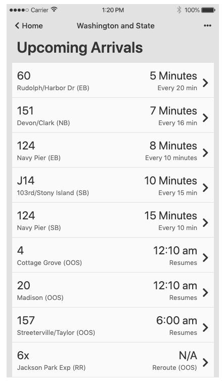

# frontend_challenge

This screen was developed for a project, in which I was also responsible for the user research and user design.

The problem presented was that, due to expansion, a city faced an issue in their public transit system. They found that users were confused as there were buses that service multiple stops and stops that served multiple lines. The scree below was my solution to this problem.

